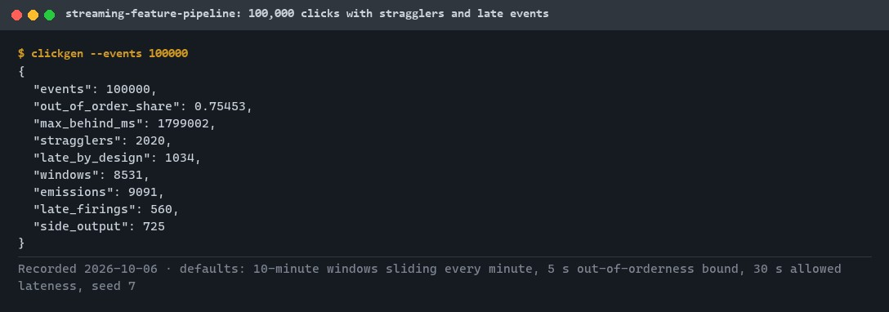
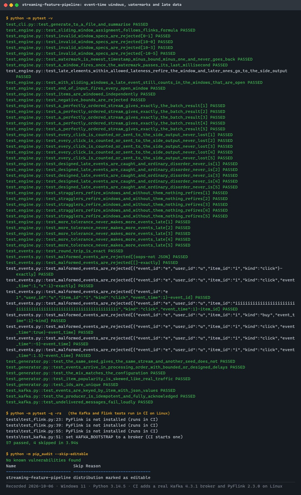
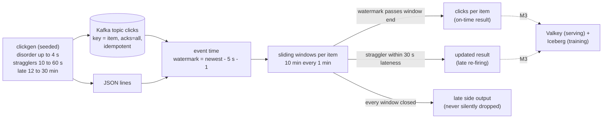
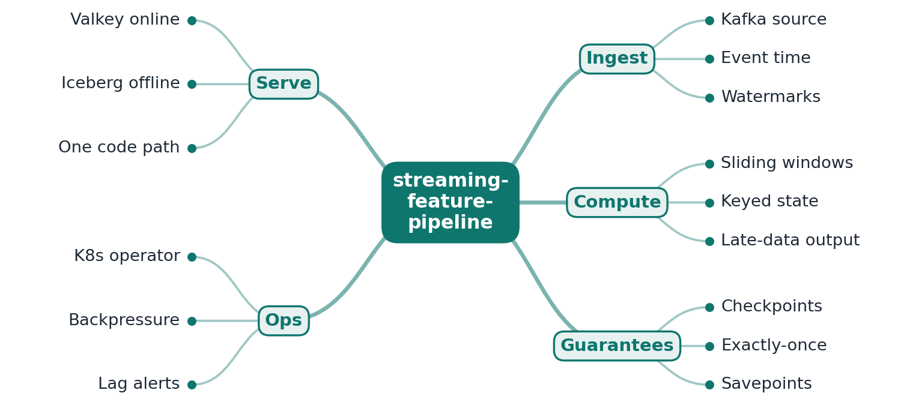
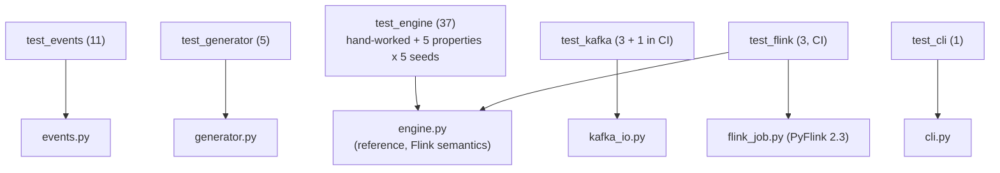

# streaming-feature-pipeline

[](https://github.com/EquinoxWN/streaming-feature-pipeline/actions/workflows/ci.yml)


> Real-time ML features from a click stream with event-time windows, where late and out-of-order events are handled explicitly; a reference engine defines the right answer and the PyFlink job is checked against it.

Part of my **Data Engineering** list · Python · core project

## Proof it works

`clickgen` generates a click stream with realistic disorder (75% of events arrive out of order, 2% are stragglers, 1% arrive late by design) and runs the reference engine over it: 8,531 windows, 560 late re-firings and 725 events routed to the side output instead of being silently dropped:



57 tests pass locally (window assignment, watermarks, allowed lateness, side output, parity with a batch recomputation). The 4 skipped tests run in CI against a real Kafka broker and PyFlink on Linux:



## Architecture

**What M1 runs today:**



**Full roadmap (M1 to M3):**



## How it works

_Steps 1 and 2 are built and tested (M1); the rest is on the [roadmap](#roadmap)._

1. A generator writes realistic click events, deliberately including out-of-order and late ones, into Kafka.
2. Flink processes by event time; watermarks decide when a window is complete, and very late events go to a side output instead of being dropped.
3. Keyed sliding windows compute features such as clicks per item in the last 10 minutes, held in RocksDB-backed state.
4. Checkpoints plus Kafka transactions give exactly-once results, even when a task manager is killed mid-stream.
5. Features go to Valkey for low-latency serving and to Iceberg for training, from the same code, so training and serving never disagree.
6. The Flink Kubernetes Operator deploys the job, and savepoints let you upgrade logic without losing state.

## Who it helps

- **Who:** Data and ML engineers computing real-time features from event streams.
- **The problem:** Late and out-of-order events silently miscount windowed features.
- **How to use it:** Generate a click stream with deliberate disorder, compute the correct answer with the reference engine, and check a stream job against it, as the PyFlink job is checked in CI.

## Tech stack

| Area | In M1 | Planned |
|---|---|---|
| Core | Python reference engine, PyFlink 2.3 (Apache Flink), Kafka | RocksDB state backend, exactly-once with Kafka transactions |
| Sinks | - | Valkey (online features), Apache Iceberg (offline training data) |
| Ops | - | Flink Kubernetes Operator, Prometheus metrics, savepoints |

Language: **Python** (3.11+). Code in [`src/streaming_feature_pipeline/`](src/streaming_feature_pipeline): the event model, generator, reference engine, Kafka I/O and the PyFlink job.

## Run it

**Prerequisites:** Python 3.11+. Kafka and Flink are optional locally: the Kafka round trip needs a broker (`KAFKA_BOOTSTRAP`), and PyFlink publishes wheels for Linux and macOS only; CI runs both.

```bash
python -m venv .venv && source .venv/bin/activate   # Windows: .venv\Scripts\activate
make setup     # install the package and dev tools
make lint      # ruff, ruff format, mypy --strict
make test      # 57 tests (Kafka and Flink tests are skipped without a broker or PyFlink)
make summary   # generate 100,000 events and summarise disorder and lateness
```

With a broker and PyFlink available (Linux or macOS with Java 17):

```bash
pip install -e ".[kafka,flink]"
KAFKA_BOOTSTRAP=localhost:9092 python -m pytest -m "kafka or flink"
clickgen --events 100000 --kafka localhost:9092 --topic clicks
```

### How late data is handled

| Delay (arrival minus event time) | What happens | Test |
|---|---|---|
| Up to 4 s (ordinary disorder) | Below the 5 s watermark bound: counted in every window, on time | designed-late test: never in the side output |
| 10 to 60 s (straggler) | Its newest windows are still open; windows that already fired but are within the 30 s allowed lateness re-fire with a corrected count | stragglers re-fire windows; a calm stream never does |
| A few minutes | Dropped from the windows that closed, still counted in the open ones (Flink's sliding-window behaviour) | partial lateness test |
| Longer than a window plus lateness (12 to 30 min) | Every window has closed: sent to the late side output, never silently dropped | exactly the designed-late clicks reach the side output |

## Tests and results

Full numbers and commands: [docs/results/m1.md](docs/results/m1.md).

| Check | Result |
|---|---|
| Tests (`make test`) | **57 passed** locally, 0 failed; Kafka (1) and Flink (3) tests run in CI |
| Nothing lost | in every generated stream, each click is counted in a window or in the side output, and final counts add up to exactly the accepted clicks |
| Late data | exactly the designed-late clicks reach the side output; ordinary disorder never does |
| Flink vs reference (CI) | exact agreement without disorder; with disorder Flink's late set is a subset of the reference's and counts lie between reference and batch |
| 100,000-event stream | 75.5% out of order, 2,020 stragglers causing 560 re-firings, 725 late clicks in the side output |
| Lint / audit | ruff, mypy `--strict` clean; `pip-audit`: no known vulnerabilities |

### Test map



## Roadmap

**M1** (≈15 h)
- [x] Write `docs/rfc/0001-design.md`: problem, goals, non-goals, chosen design
- [x] A generator writes realistic click events, deliberately including out-of-order and late ones, into Kafka.
- [x] Flink processes by event time; watermarks decide when a window is complete, and very late events go to a side output instead of being dropped.

**M2** (≈20 h)
- [ ] Keyed sliding windows compute features such as clicks per item in the last 10 minutes, held in RocksDB-backed state.
- [ ] Checkpoints plus Kafka transactions give exactly-once results, even when a task manager is killed mid-stream.

**M3** (≈25 h)
- [ ] Features go to Valkey for low-latency serving and to Iceberg for training, from the same code, so training and serving never disagree.
- [ ] The Flink Kubernetes Operator deploys the job, and savepoints let you upgrade logic without losing state.
- [ ] Publish the proof below with real numbers

## Proof

What this repo must show before it counts as done:

- A kill-the-worker demo with identical output counts, plus throughput and latency at several event rates.

| Result | Value |
|---|---|
| M3 proof above | Not measured yet (M3). Current M1 numbers: see [Tests and results](#tests-and-results). |

## Why it matters

- **Interview angle:** 'Design real-time metrics with exactly-once guarantees'.
- **Upstream I'd like to contribute to:** Apache Flink (with major contributions from Alibaba).

## Design docs

- [RFC 0001: design](docs/rfc/0001-design.md)
- [ADR 0001: record architecture decisions](docs/adr/0001-record-architecture-decisions.md)
- [ADR 0002: reference engine as the oracle for Flink](docs/adr/0002-reference-engine-as-oracle-for-flink.md)
- [ADR 0003: make late data visible](docs/adr/0003-make-late-data-visible.md)
- [M1 results](docs/results/m1.md)

## Scope

This is a learning and portfolio system, not a hosted production service. Everything runs locally.

## Security and contributing

- Every GitHub Action is pinned to a commit SHA; workflows run read-only, without persisted credentials.
- Dependabot proposes dependency and action updates weekly.
- Events from Kafka are parsed strictly (exact keys, id pattern, integer time); the producer is idempotent with `acks=all`; CI runs `pip-audit` on every push.
- Report vulnerabilities privately: see [SECURITY.md](SECURITY.md). To contribute, see [CONTRIBUTING.md](CONTRIBUTING.md).

## License

MIT, see [LICENSE](LICENSE).
